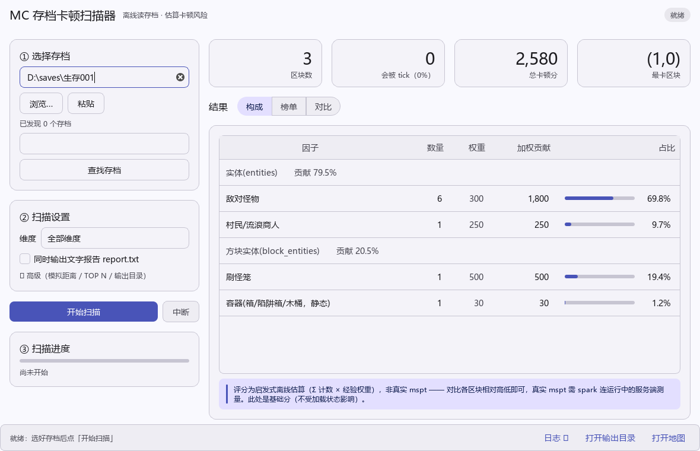
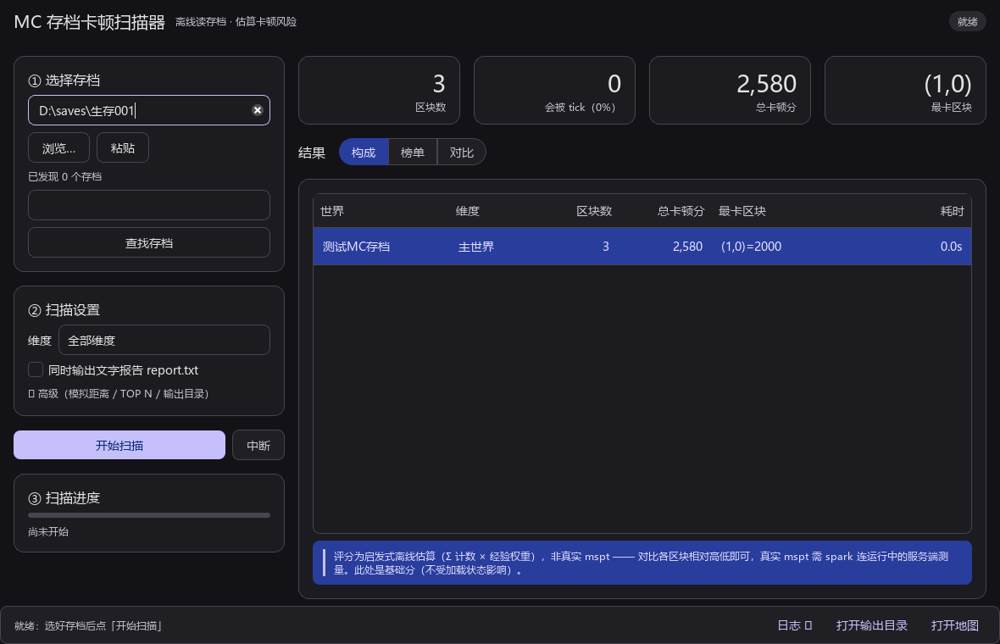

# MCChunkLag · MC 存档区块卡顿原因分析器

> 读一份 Minecraft **Java 版**存档文件，找出「**哪些区块在拖慢服务器、卡在哪**」。
> 纯离线静态分析 —— 不需要运行中的服务端，也不需要装任何 mod。
> **分析引擎与 CLI 零第三方依赖**（纯标准库）；图形界面用 PySide6（Qt 6），见「快速开始」。

思路借鉴 [spark](https://spark.lucko.me/) 的「分组聚合 + 占比 + 下钻 + 排名」：spark 靠**运行时采样**告诉你现在谁在烧 CPU，本项目靠**存档里的静态事实**告诉你哪些区块一被加载就会持续干活。两者互补 —— 存档分析适合「服务器卡但抓不到现场」和「改造前先摸清底数」。

## 它回答两个问题

1. **哪种卡顿原因占大头** —— 分组占比树（实体 / 方块实体 / 方块 / 装置），可下钻到具体因子
2. **哪几个区块最可能卡** —— 最卡 TOP 榜 + 可缩放的交互式热力图

## 特性

- **spark 式报告**：终端文字报告 / HTML 报告，占比树 + 下钻 + 排名
- **交互式热力图**：Canvas 逐像素渲染，缩放 / 平移 / 悬停下钻看单区块因子明细 / TOP 面板 / 坐标轴与比例尺（对齐游戏 F3 的方块坐标）
- **常加载区识别**（关键）：出生点恒加载、`/forceload`、FTB `chunks.dat`、成对地狱门装置、末影珍珠加载器、矿车地狱门 —— **不被加载的区块根本不 tick，不产生 MSPT**
- **新老存档通吃**：1.8 旧布局 → 1.13+ 扁平区块 → 1.16+ 实体分区 → 1.18+/1.20.2 扁平 section → 26.x 新 `dimensions/` 布局，整合包「新旧混存 + 自定义维度」也支持
- **三个入口**：图形界面（PySide6）/ 单存档 CLI / 批量扫描
- **引擎零依赖**：分析、CLI、批量扫描只用标准库；只有图形界面需要 PySide6

## 快速开始

需要 **Python 3.8+**（开发环境实测 3.13）。

```bash
git clone https://github.com/looking321-rt/MCChunkLag.git
cd MCChunkLag

# 只跑 CLI：零依赖，不用装任何东西
python main.py "C:/Users/you/AppData/Roaming/.minecraft/saves/我的世界" --map out/map.html

# 要用图形界面：装 PySide6（约 100 MB）
pip install -r requirements.txt
```

浏览器打开 `out/map.html` 即为热力图。

## 用法

### 1. 图形界面（日常首选）

双击 `启动界面.bat`（可把存档文件夹直接拖到 bat 上带路径启动），或：

```bash
pip install -r requirements.txt     # 首次：装 PySide6
python chunklag/gui.py [存档目录]
```

左右分栏：**左栏**是任务（选存档 → 扫描设置 → 开始/中断 → 进度），**右栏**是结果三视图：

| 视图 | 内容 |
|---|---|
| **构成** | 占比树（大类 → 因子 + 占比条），**按加权贡献降序** —— 直接回答「哪种原因占大头」 |
| **榜单** | 最卡 TOP 区块（评分 + 评分条 + 因子明细），双击用浏览器打开该地图 |
| **对比** | 多「世界 × 维度」一览（点列头排序、双击打开该行地图） |

其余：统计行 4 张卡（区块数 / **会被 tick 的区块数** / 总卡顿分 / 最卡区块）；状态胶囊实时报进度；
日志降级为底部一行「最近一条」+〔日志 ▾〕展开抽屉；`▸ 高级` 折叠着模拟距离 / TOP N / 输出目录。
**报告仍走 HTML、不在界面内嵌渲染** —— 这是「扫大存档界面也不卡」的关键。
界面跟随系统明暗（不做手动主题开关），色值集中在 `chunklag/ui_tokens.py`，窗口尺寸与上次路径记在 `~/.mcchunklag.json`。

界面预览（`python tests/ui_shots.py` 一键重出，离屏渲染；图里路径是演示用的假路径）：




### 2. 单存档 CLI

```bash
python main.py <存档目录>                    # 终端报告（默认主世界，TOP 10）
python main.py <存档目录> --dim all          # 全维度
python main.py <存档目录> --top 20           # 最卡 TOP 20
python main.py <存档目录> --html report.html # HTML 报告
python main.py <存档目录> --dim all --map out/map.html
                                            # 每维度一份图（out/主世界/map.html …），页面左上角可切换
python main.py <存档目录> --map out/map.html --scoped
                                            # 只画「玩家模拟区 ∪ 常加载区」（默认画全量）
```

| 参数 | 说明 |
|---|---|
| `--dim` | `0` 主世界（默认）/ `-1` 下界 / `1` 末地 / `all` 全维度 |
| `--top` | 最卡 TOP N（默认 10） |
| `--map` | 输出 HTML 交互地图 |
| `--scoped` | 只输出「玩家模拟区 ∪ 常加载区」（旧口径） |
| `--simdist` | 玩家模拟距离（区块，默认 10），决定模拟区边长 `2s+1` |
| `--player X Z` | 手动指定玩家方块坐标（默认自动从存档读） |
| `--limit-chunks` | 每维度最多分析多少区块（快速预览用） |

### 3. 批量扫描（多存档对比）

```bash
python scan.py <saves目录或单个世界目录> --out output [--dim all] [--txt] [--open]
```

产出：

```
output/
  01_我的世界/主世界/map.html      每「世界 × 维度」一份交互热力图
  01_我的世界/主世界/report.txt    （--txt 时）spark 式文字报告
  汇总.txt                        所有「世界 × 维度」对比一览（按总卡顿分降序）
```

自动发现存档：含 `level.dat` 即算一个世界（hlmc / PCL 整合包的多层目录都能挖到）。
**批量扫描是可中断的软停** —— 中断后已完成的世界照常出图出报告，不白等。

## 评分怎么算（⚠️ 必读）

**离线只能近似**：spark 的 mspt 来自运行时采样，单机存档里没有这些数据。本项目的评分是**启发式** —— 用「该区块若被加载会持续干多少活」估算，**不是真实 mspt**。

以 **0.01** 为最小权重单位（如 `600` = 6.00 基准分/个）：

**两层分**：
- **基础分 `s`** = Σ(计数 × 权重) —— 该区块「若被加载会有多贵」，**地图着色**用它
- **有效分 `e`** = `s` × 加载系数 —— 常加载区 **×2**、玩家模拟区 **×1**、其余 **×0**（不 tick 就没有 MSPT），**TOP 榜与排序**用它

**权重表**（完整分档见 [`设计总纲.md`](设计总纲.md)）：

| 类别 | 代表 | 权重 | 依据 |
|---|---|---|---|
| 实体 | BOSS / TNT / 刷怪笼矿车 | 600 | AI 最重 / 持续执行 |
| 实体 | 敌对怪物 | 300 | 索敌 + 寻路 |
| 实体 | 掉落物 | 3 | **按「堆」计**：一堆 = 一个实体，60s 后消失 |
| 方块实体 | 漏斗 | 600 | **每 tick** 扫上方物品实体 |
| 方块实体 | 刷怪笼 / 幽匿系 / 命令方块 | 400~500 | 持续尝试或每 tick 执行 |
| 方块实体 | 容器（箱/木桶） | 30 | **静态**，被比较器读才醒 |
| 方块 | 活跃红石（通电的粉/中继器/侦测器） | 150 | 按**个数**计（需解码位压缩数组） |
| 方块 | 火 / 灵魂火 | 150 | 持续 tick |

**刻意不收的类别**（踩过的坑，别再往回加）：**流体**与**生长类**（作物/树苗/甘蔗/树叶…）—— 稳态流体不再产生 scheduled tick，而随机刻是每 section **固定抽样**、与方块数量无关，按个数计是量纲错误。曾加上后单个存档里这两类独吞 **95.6%** 总分，把玩家装置完全挤出榜单。需要这类信息请用 `tests/diag_ids.py`（只统计、不计分）。

## 常加载区识别

区块不被加载就完全不 tick，所以「谁在常加载」比「谁分数高」更决定实际开销：

| 加载器 | 判据 |
|---|---|
| 出生点恒加载 | `SpawnX/Z` + `spawnChunkRadius`（仅主世界有此机制） |
| `/forceload` | `level.dat` 的 `ForcedChunks` |
| mod 常加载 | FTB `data/chunks.dat` 的 `ForgeForced`（含周边 3×3 带动） |
| **成对地狱门装置** | **主世界与下界两侧都有门、且两侧都有红石装置/矿车加载证据**才算（纯装饰门、单侧一律不标） |
| 末影珍珠加载器 | `players/data/<uuid>.dat` 的 `ender_pearls` 列表（能留在存档里的珍珠必然正处于静滞加载） |
| 矿车地狱门 | 传送门方块 + 矿车实体 + **已激活**的动力铁轨（1.21.2+ 穿门冷却 0.5s） |

范围口径：出生点 `spawnChunkRadius`、地狱门 5×5、末影珍珠 3×3（均为官方「完全加载 + 外围 lazy」口径）。

## 支持的存档版本

| 版本/形态 | 支持情况 |
|---|---|
| 1.8 ~ 1.12（`TileEntities` / 有 `Level` 包裹） | ✅ |
| 1.13+（`block_entities` / 扁平区块） | ✅ |
| 1.16+（实体分区 `entities/r.x.z.mca`） | ✅ |
| 1.18+ / 1.20.2（section 顶层扁平、`block_states.palette`） | ✅ |
| 1.21.2+（矿车穿门加载器） | ✅ |
| 26.x（`dimensions/<ns>/<dim>/` + `players/data/`） | ✅ |
| 整合包混存（旧 `region/` + `dimensions/` 自定义维度） | ✅ |

## 项目结构

```
chunklag/
  nbt.py        NBT 解析（全 12 种标签）
  region.py     .mca 解析（8KB 定位表 + 压缩类型 1/2/3）
  leveldat.py   level.dat → 世界名 / 版本 / 玩家位置
  layout.py     存档布局（新旧 + 混存）、维度映射、出生点
  entitypart.py 1.16+ 实体分区读取
  factors.py    卡顿因子分类 + 经验权重 + 计数提取
  analyze.py    spark 式分组聚合 / 下钻 / TOP 榜
  loaders.py    常加载区识别（出生点 / forceload / FTB / 门 / 珍珠 / 矿车）
  mapdata.py    地图数据导出（bounds / 分位阈值 / 每区块评分 / TOP）
  mapview.py    HTML 交互地图渲染
  report.py     终端 + HTML 报告
  scanjob.py    扫描引擎（可中断 + 进度回调，GUI 与 CLI 共用）
  ui_tokens.py  Qt 设计令牌（15 个颜色角色 = 全项目唯一色值定义处 + QSS）
  gui.py        PySide6 界面（选存档 → 扫描 → 构成 / 榜单 / 对比三视图）
main.py         单存档 CLI
scan.py         批量扫描 CLI
tests/          自测 + 合成测试存档生成器 + 诊断工具
```

## 开发与自测

```bash
python tests/test_pipeline.py    # 解析链路 / 因子分类 / 报告渲染（196 项）
python tests/test_scanjob.py     # 扫描引擎（进度 / 中断 / 输出结构）+ 界面（137 项，离屏跑不弹窗）
python tests/ui_shots.py         # 界面预览图 11 张 + 硬指标断言 13 项（tests/ui_preview/）
```

测试用合成存档（`tests/make_fixture.py` 现场生成，不入库），覆盖新版布局、门判据、珍珠、矿车、混存布局等易回退点。
界面测试与预览图都跑**离屏平台**（`QT_QPA_PLATFORM=offscreen`）：无需桌面会话、也不会弹真窗口。

诊断工具（排查真实存档用）：

```bash
python tests/diag_ids.py <存档>            # 实体/方块实体 id 分布 + 落到兜底桶的种类
python tests/diag_color.py <存档>          # 评分分布与色阶阈值
python tests/diag_portal.py <saves目录>    # 逐装置打印门判据 + 落选原因
python tests/diag_new_layout.py <存档>     # 新版布局证据探针
python tests/diag_top_marker.py <map.html> # TOP 红块评分 / 邻居 / 是否溢出
```

## 已知限制

- 评分是**启发式排序**，不是真实 mspt；跨存档比绝对值意义有限，**比排名与占比更有意义**
- 只做静态分析：TNT 爆炸、临时性卡顿、区块生成开销这类**动态事件**抓不到
- 不解析 mod 自定义方块实体的语义，未知类型落「其它」兜底档
- 位压缩方块数组按 padded 打包解码，解出索引越界比例超 1% 的段落直接丢弃（宁可漏，不可虚高）

## 许可

[MIT](LICENSE)
